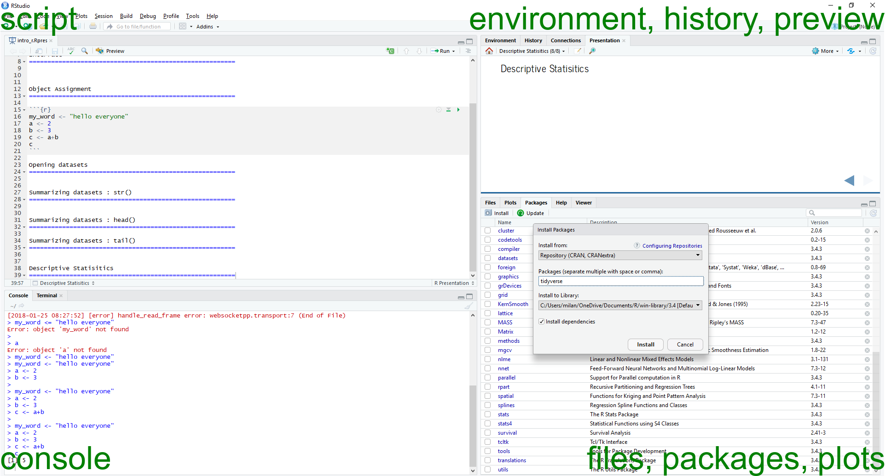
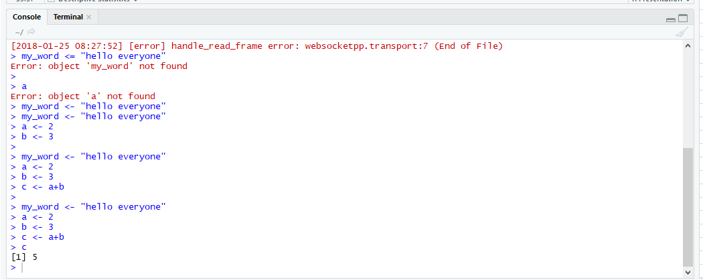
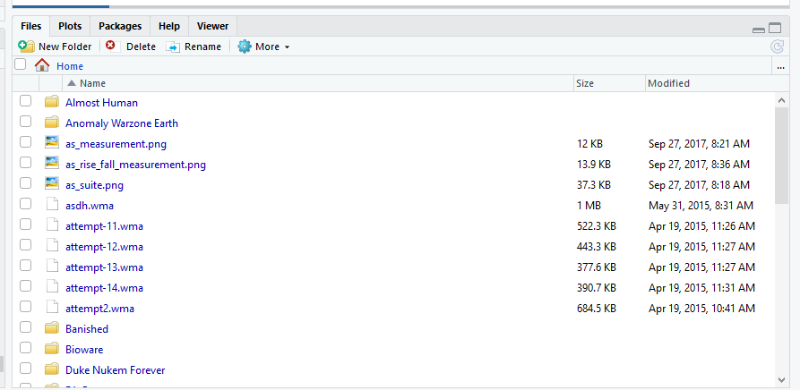
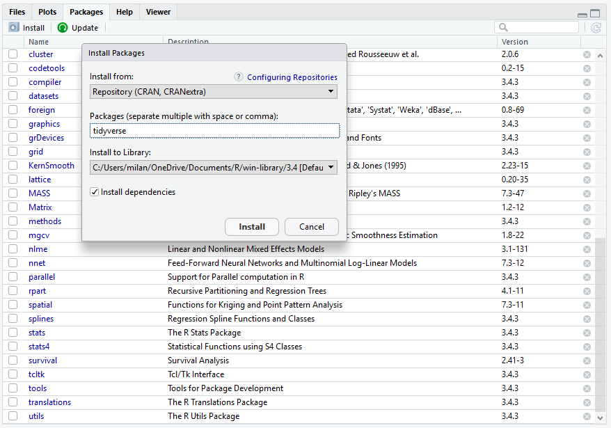

intro_r
========================================================
author: Mine Dogucu and Catherine Holloway
date: January 29th, 2018
autosize: true
% this presentation needs the magick package


Interface
========================================================




Console - Lower Left Corner
===========================



Files - Lower Right Corner
===========================



Packages - Lower Right Corner
===========================




Object Assignment
========================================================


```r
my_word <- "hello everyone"
a <- 2
b <- 3
c <- a+b
c
```

```
[1] 5
```

Opening datasets
========================================================


```r
library(readr)
nc <- read_csv("C:/Users/milan/r_projects/meetup-presentations_sarasota/2018_01_29_intro_R/nc.csv")
print(nc)
```

```
# A tibble: 1,000 x 13
    fage  mage mature      weeks premie    visits marital gained weight
   <int> <int> <chr>       <int> <chr>      <int> <chr>    <int>  <dbl>
 1    NA    13 younger mom    39 full term     10 married     38   7.63
 2    NA    14 younger mom    42 full term     15 married     20   7.88
 3    19    15 younger mom    37 full term     11 married     38   6.63
 4    21    15 younger mom    41 full term      6 married     34   8.00
 5    NA    15 younger mom    39 full term      9 married     27   6.38
 6    NA    15 younger mom    38 full term     19 married     22   5.38
 7    18    15 younger mom    37 full term     12 married     76   8.44
 8    17    15 younger mom    35 premie         5 married     15   4.69
 9    NA    16 younger mom    38 full term      9 married     NA   8.81
10    20    16 younger mom    37 full term     13 married     52   6.94
# ... with 990 more rows, and 4 more variables: lowbirthweight <chr>,
#   gender <chr>, habit <chr>, whitemom <chr>
```

Summarizing datasets : str()
========================================================


```r
str(nc)
```

```
Classes 'tbl_df', 'tbl' and 'data.frame':	1000 obs. of  13 variables:
 $ fage          : int  NA NA 19 21 NA NA 18 17 NA 20 ...
 $ mage          : int  13 14 15 15 15 15 15 15 16 16 ...
 $ mature        : chr  "younger mom" "younger mom" "younger mom" "younger mom" ...
 $ weeks         : int  39 42 37 41 39 38 37 35 38 37 ...
 $ premie        : chr  "full term" "full term" "full term" "full term" ...
 $ visits        : int  10 15 11 6 9 19 12 5 9 13 ...
 $ marital       : chr  "married" "married" "married" "married" ...
 $ gained        : int  38 20 38 34 27 22 76 15 NA 52 ...
 $ weight        : num  7.63 7.88 6.63 8 6.38 5.38 8.44 4.69 8.81 6.94 ...
 $ lowbirthweight: chr  "not low" "not low" "not low" "not low" ...
 $ gender        : chr  "male" "male" "female" "male" ...
 $ habit         : chr  "nonsmoker" "nonsmoker" "nonsmoker" "nonsmoker" ...
 $ whitemom      : chr  "not white" "not white" "white" "white" ...
 - attr(*, "spec")=List of 2
  ..$ cols   :List of 13
  .. ..$ fage          : list()
  .. .. ..- attr(*, "class")= chr  "collector_integer" "collector"
  .. ..$ mage          : list()
  .. .. ..- attr(*, "class")= chr  "collector_integer" "collector"
  .. ..$ mature        : list()
  .. .. ..- attr(*, "class")= chr  "collector_character" "collector"
  .. ..$ weeks         : list()
  .. .. ..- attr(*, "class")= chr  "collector_integer" "collector"
  .. ..$ premie        : list()
  .. .. ..- attr(*, "class")= chr  "collector_character" "collector"
  .. ..$ visits        : list()
  .. .. ..- attr(*, "class")= chr  "collector_integer" "collector"
  .. ..$ marital       : list()
  .. .. ..- attr(*, "class")= chr  "collector_character" "collector"
  .. ..$ gained        : list()
  .. .. ..- attr(*, "class")= chr  "collector_integer" "collector"
  .. ..$ weight        : list()
  .. .. ..- attr(*, "class")= chr  "collector_double" "collector"
  .. ..$ lowbirthweight: list()
  .. .. ..- attr(*, "class")= chr  "collector_character" "collector"
  .. ..$ gender        : list()
  .. .. ..- attr(*, "class")= chr  "collector_character" "collector"
  .. ..$ habit         : list()
  .. .. ..- attr(*, "class")= chr  "collector_character" "collector"
  .. ..$ whitemom      : list()
  .. .. ..- attr(*, "class")= chr  "collector_character" "collector"
  ..$ default: list()
  .. ..- attr(*, "class")= chr  "collector_guess" "collector"
  ..- attr(*, "class")= chr "col_spec"
```


Summarizing datasets : head()
========================================================


```r
head(nc)
```

```
# A tibble: 6 x 13
   fage  mage mature      weeks premie    visits marital gained weight
  <int> <int> <chr>       <int> <chr>      <int> <chr>    <int>  <dbl>
1    NA    13 younger mom    39 full term     10 married     38   7.63
2    NA    14 younger mom    42 full term     15 married     20   7.88
3    19    15 younger mom    37 full term     11 married     38   6.63
4    21    15 younger mom    41 full term      6 married     34   8.00
5    NA    15 younger mom    39 full term      9 married     27   6.38
6    NA    15 younger mom    38 full term     19 married     22   5.38
# ... with 4 more variables: lowbirthweight <chr>, gender <chr>,
#   habit <chr>, whitemom <chr>
```


Summarizing datasets : tail()
========================================================


```r
tail(nc)
```

```
# A tibble: 6 x 13
   fage  mage mature     weeks premie    visits marital     gained weight
  <int> <int> <chr>      <int> <chr>      <int> <chr>        <int>  <dbl>
1    NA    41 mature mom    33 premie        13 not married      0   5.69
2    47    42 mature mom    40 full term     10 not married     26   8.44
3    34    42 mature mom    38 full term     18 not married     20   6.19
4    39    45 mature mom    40 full term     15 not married     32   6.94
5    55    46 mature mom    31 premie         8 not married     25   4.56
6    45    50 mature mom    39 full term     14 not married     23   7.13
# ... with 4 more variables: lowbirthweight <chr>, gender <chr>,
#   habit <chr>, whitemom <chr>
```


Descriptive Statisitics
========================================================


```r
summary(nc)
```

```
      fage            mage       mature              weeks      
 Min.   :14.00   Min.   :13   Length:1000        Min.   :20.00  
 1st Qu.:25.00   1st Qu.:22   Class :character   1st Qu.:37.00  
 Median :30.00   Median :27   Mode  :character   Median :39.00  
 Mean   :30.26   Mean   :27                      Mean   :38.33  
 3rd Qu.:35.00   3rd Qu.:32                      3rd Qu.:40.00  
 Max.   :55.00   Max.   :50                      Max.   :45.00  
 NA's   :171                                     NA's   :2      
    premie              visits       marital              gained     
 Length:1000        Min.   : 0.0   Length:1000        Min.   : 0.00  
 Class :character   1st Qu.:10.0   Class :character   1st Qu.:20.00  
 Mode  :character   Median :12.0   Mode  :character   Median :30.00  
                    Mean   :12.1                      Mean   :30.33  
                    3rd Qu.:15.0                      3rd Qu.:38.00  
                    Max.   :30.0                      Max.   :85.00  
                    NA's   :9                         NA's   :27     
     weight       lowbirthweight        gender             habit          
 Min.   : 1.000   Length:1000        Length:1000        Length:1000       
 1st Qu.: 6.380   Class :character   Class :character   Class :character  
 Median : 7.310   Mode  :character   Mode  :character   Mode  :character  
 Mean   : 7.101                                                           
 3rd Qu.: 8.060                                                           
 Max.   :11.750                                                           
                                                                          
   whitemom        
 Length:1000       
 Class :character  
 Mode  :character  
                   
                   
                   
                   
```
